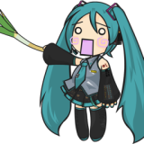

<div align="center">
  

  # UntitledCharts Frontend
  
  <p>
    <b>A Sonolus Community Chart Server</b>
  </p>

  <p>
    <a href="https://nextjs.org"></a>
    <a href="https://react.dev"></a>
    <a href="https://sonolus.com"></a>
  </p>
</div>

---

## 📖 About
**UntitledCharts** is a modern, community-driven platform for sharing and discovering custom charts for rhythm games. This frontend is built with **Next.js 15**, focusing on performance, aesthetics, and a premium user experience.

---

## 🚀 Getting Started

First, install the dependencies:

```bash
npm install
# or
yarn install
```

Then, run the development server:

```bash
npm run dev
```

Open [http://localhost:3000](http://localhost:3000) with your browser to see the result.

---

## 🛠️ Tech Stack

- **Framework**: [Next.js 15](https://nextjs.org) (App Router)
- **Styling**: Native CSS Modules & Global Styles
- **OG Generation**: `next/og` (Satori)
- **Deployment**: Vercel

---
